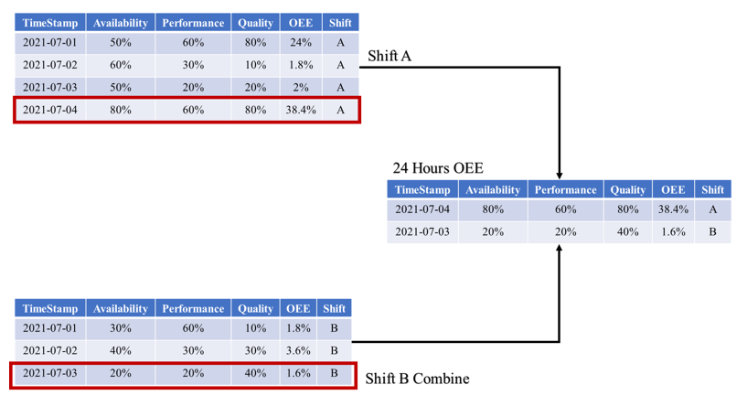
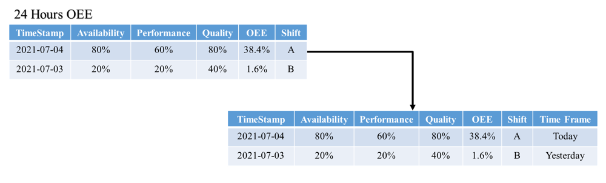

# 24-Hours-OEE-With-2-Shift-SQL-Query
This code will query and calculate the real-time OEE data that has 2 Shift where Shift 1 ranges from 8:00:00am to 7:59:59pm and Shift 2 ranges from 8:00:00pm to 7:59:59am using 4 steps.

# Step 1

The first process of this code is splitting the data into 3 different views. The views be named Shift A, Shift B Part 1, and Shift B Part 2. Shift A will store data for the morning shift which is any data from 8:00:00 am to 7:59:59pm, Shift B part 1 will store any data from 8:00:00 pm to 12:00:00 am, and Shift B part 2 will be storing any data from 1:00:00 am to 7:59:59 am. The view will then be grouped together by their timestamp using the group by function and the output will be summed together using the sum function.

# Step 2

The second process of the code is to combine Shift B part 1 and 2 together in a view called Shift B Combination. In this step, 1 day is added to the timestamp from Shift B part 1 using the DATEADD function. This allows the data from Shift B Part 1 to be combined with data from Shift B part 2 according to their timestamps which the output will be summed together.

# Step 3

Next, by performing the same calculation and joining it with Shift A and Shift B Combination, we will be able to identify the OEE for Shift A and Shift B Combination. This moves us to the next process which is to query the latest data from Shift A and the latest data from Shift B Combination and joining them together in a view called 24 Hours OEE using a simple UNION function such as “Select * FROM Shift A Order by Timestamp decs limit 1 union Select * FROM Shift B Combine Order by Timestamp decs”.  

# Step 4

Finally, the view named 24 Hours OEE will be placed in a case statement to identify the timeframe of data. The case statement compares the timestamp with today’s date using the GETDATE() function to identify if the date is either today or yesterday. The example of the current date used is 2021-07-04 which makes Shift A data Today and Shift B data Yesterday. Then, a where statement will then be added to eliminate any row that has the data Yesterday to identify the 24 Hours OEE with 2 Shift data such as “Select * FROM 24 Hours OEE where Time Frame = ‘Today’”. For example, only 1 data is displayed which is Shift A, however, if there is 2 Today in the Time Frame as the date has not cross over to the next day, all the data will be added and be divided by 2 to get the 24 Hours OEE with 2 Shifts which will end this entire process. 
